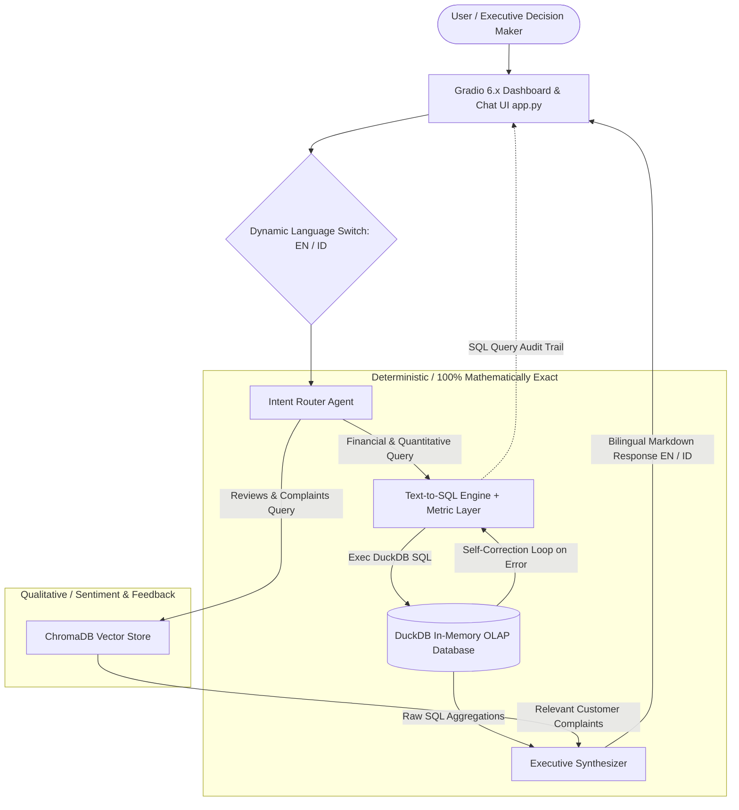

# 🛒 Marketplace Intelligence System (Hybrid RAG)

[](https://huggingface.co/spaces/rfahrur6045/rag-marketplace-intelligence)
[](LICENSE)
[](https://python.org)
[](https://gradio.app)
[-brightgreen.svg)](evaluate.py)

> **Enterprise-grade Executive Assistant & Anti-Hallucination Hybrid RAG for Multi-Channel E-Commerce Intelligence (Tokopedia, Shopee, TikTok Shop, Lazada).**

---

## 🎯 1. Executive Summary & Business Problem

In modern multi-channel e-commerce, executive decision-makers (C-Suite, Brand Managers, and Operations Leads) face two critical challenges:

1. **Fragmented & Disparate Data:** Transaction records across Tokopedia, Shopee, TikTok Shop, and Lazada feature inconsistent schemas, ambiguous return statuses, and conflicting fee/voucher structures.
2. **LLM Numerical Hallucinations (The Fatal Flaw of Vanilla RAG):** Standard vector-embedding RAG **inevitably hallucinates** when calculating financial aggregations (Net GMV, margins, and return rates) because vector similarity cannot perform deterministic mathematical operations.

### The Solution:
**Marketplace Intelligence System** bridges this gap using a **Two-Pronged Hybrid RAG Architecture**:
* **Deterministic Path (DuckDB OLAP Engine + Semantic Metric Layer):** Converts natural language business questions into 100% mathematically precise DuckDB SQL queries.
* **Qualitative Path (ChromaDB Vector Store):** Performs semantic search across customer reviews to pinpoint the qualitative root causes behind product returns and negative ratings.

---

## 🏗️ 2. System Architecture & Data Flow



---

## 🌟 3. Engineering Highlights & Technical Depth

1. **Anti-Hallucination Semantic Metric Layer:**
   * Enforces standardized business accounting rules defined in [`docs/metrics_dictionary.md`](docs/metrics_dictionary.md).
   * Net GMV is strictly calculated from `COMPLETED` orders minus verified seller vouchers and platform fees, completely eliminating financial hallucination.
2. **Text-to-SQL with Autonomous Self-Correction:**
   * When an LLM generates a syntax error or references an invalid function, the backend catches the DuckDB exception and triggers an automatic internal self-repair prompt loop before responding to the user.
3. **Model Fallback Cascade & High-Traffic Resilience:**
   * Handles server load surges and rate limits (HTTP 503 / 429) gracefully using an automated model cascade: `Gemini 3.6 Flash` $\rightarrow$ `Gemini 2.0 Flash` $\rightarrow$ `Gemini 1.5 Flash` paired with exponential backoff retries.
4. **Dynamic Bilingual Support (EN & ID):**
   * Instant runtime language toggle between **EN (English)** and **ID (Bahasa)**. The executive dashboard, KPI cards, table column headers, and synthesized executive reports adapt immediately without page reload.
5. **Full Transparency (Audit Trail Code Inspector):**
   * Features an interactive *Audit Trail* accordion exposing the exact DuckDB SQL query generated and executed under the hood.
6. **Cloud Native & ZeroGPU Ready:**
   * Includes automated container cold-start database provisioning for Hugging Face Spaces and runtime ZeroGPU compatibility wrappers.

---

## 🛠️ 4. Tech Stack & Architectural Trade-offs

| Component | Technology | Trade-offs & Architectural Rationale |
| :--- | :--- | :--- |
| **Analytical Engine (OLAP)** | DuckDB Native Engine | In-process columnar analytics engine delivering 10–50x faster analytical query performance than SQLite/Pandas without standalone database server overhead. |
| **Vector Database** | ChromaDB Persistent Store | Embedded, low-latency vector store providing semantic search for customer feedback without recurring managed-cloud database fees. |
| **LLM & Reasoning** | Google Gemini (Cascade: 3.6 / 2.0 / 1.5) | Selected for ultra-low inference latency, large context handling, high Text-to-SQL accuracy, and superior cost-performance ratio. |
| **Frontend & UI** | Gradio 6.x | Interactive, responsive web UI with dynamic reactive state management, bilingual switching, and seamless one-click Hugging Face deployment. |
| **Automated Testing** | Pytest & Evaluation Suite (`evaluate.py`) | Automated end-to-end verification covering database connectivity, business metric calculations, vector indexing, and intent classification (100% Pass). |

---

## 🚀 5. Quickstart Guide

### 1. Prerequisites & Repository Clone
```powershell
git clone https://github.com/rfahur11/rag-marketplace.git
cd rag-marketplace
```

### 2. Setup Virtual Environment
```powershell
py -m venv .venv
.\.venv\Scripts\activate
pip install -r requirements.txt
```

### 3. Configure Environment Variables
Copy `.env.example` to `.env` and insert your Gemini API Key:
```env
GEMINI_API_KEY=your_gemini_api_key_here
```

### 4. Run Pipeline, Tests & Launch Application
```powershell
# Ensure virtualenv is active
.\.venv\Scripts\activate

# 1. Ingest & clean multi-channel data into DuckDB
python src/data_pipeline.py

# 2. Run automated test evaluation suite
python evaluate.py

# 3. Launch local Gradio application
python app.py
```

Open your browser at `http://127.0.0.1:7860`.

---

## 📂 6. Project Structure

```text
rag-marketplace/
├── SYSTEM_STATE.md            # Living context & active project runbook
├── data/                      # Local data storage (raw_marketplace.csv & marketplace.duckdb)
├── docs/                      # Architecture blueprints & business metrics dictionary
│   ├── metrics_dictionary.md  # Standardized accounting formulas for Text-to-SQL
│   └── PORTFOLIO_SHOWCASE.md  # International Social Media & Showcase Pack
├── src/                       # Production Core Logic
│   ├── data_pipeline.py       # Data generation, cleaning, and DuckDB ingestion
│   ├── database.py            # Database access layer (DuckDB & ChromaDB vector store)
│   └── rag_engine.py          # Intent router, Text-to-SQL, self-correction & synthesizer
├── app.py                     # Bilingual Gradio 6.x Executive Dashboard & Chatbot
├── evaluate.py                # Automated 4/4 verification suite
├── requirements.txt           # Python dependencies
└── README.md                  # Main International Portfolio Landing Page
```

---

## 📄 License
Distributed under the MIT License. See `LICENSE` for details.
