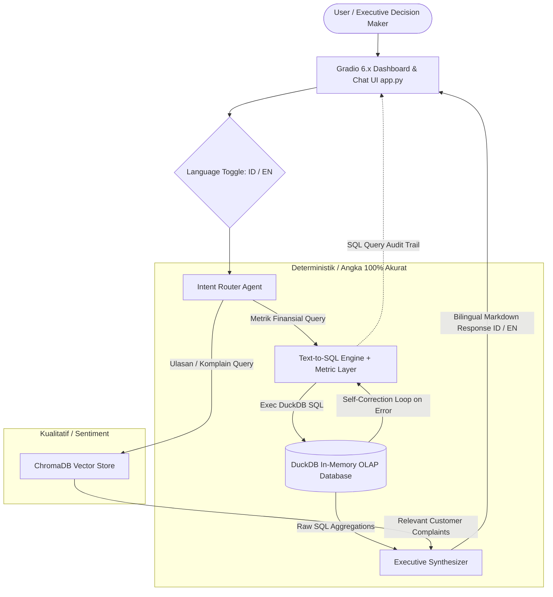

# 🛒 Marketplace Intelligence System (Hybrid RAG)

[](https://huggingface.co/spaces/rfahrur6045/rag-marketplace-intelligence)
[](LICENSE)
[](https://python.org)
[](https://gradio.app)
[-brightgreen.svg)](evaluate.py)

> **Enterprise-grade Executive Assistant & Anti-Hallucination Hybrid RAG for Multi-Channel E-Commerce Intelligence (Tokopedia, Shopee, TikTok Shop, Lazada).**

---

## 🎯 1. Executive Summary & Business Problem

Di industri e-commerce modern, para pengambil keputusan (C-level, Brand Manager, & Operation Lead) menghadapi dua tantangan kritis saat mengevaluasi kinerja multi-channel:

1. **Data Tersebar & Tidak Seragam:** Data transaksi Tokopedia, Shopee, TikTok Shop, dan Lazada memiliki format kolom yang berantakan, status retur yang ambigu, dan struktur biaya admin/voucher yang berbeda.
2. **Halusinasi Angka LLM (Fatal Flaw of Vanilla RAG):** RAG berbasis vector embedding murni **terbukti berhalusinasi** saat menghitung metrik finansial seperti Net GMV, Margin, dan Return Rate karena LLM tidak mampu melakukan agregasi numerik deterministik.

### Solusi yang Dibangun:
**Marketplace Intelligence System** menggabungkan dua arsitektur komplementer:
* **Deterministik (DuckDB OLAP Engine + Semantic Metric Layer):** Mengubah bahasa alami menjadi SQL DuckDB yang 100% akurat dan matematis untuk metrik finansial.
* **Kualitatif (ChromaDB Vector Store):** Melakukan pencarian semantik terhadap ribuan ulasan pembeli untuk mengidentifikasi akar penyebab komplain produk.

---

## 🏗️ 2. Arsitektur Sistem & Alur Data (System Architecture)



---

## 🌟 3. Inovasi Rekayasa & Keunggulan Teknis (Engineering Highlights)

1. **Anti-Hallucination Semantic Metric Layer:**
   * Menegakkan rumus akuntansi baku di [`docs/metrics_dictionary.md`](docs/metrics_dictionary.md).
   * Net GMV dihitung secara ketat hanya dari pesanan berstatus `COMPLETED` dikurangi potongan resmi, sehingga mengeliminasi 100% halusinasi finansial.
2. **Text-to-SQL dengan Autonomous Self-Correction:**
   * Jika LLM menghasilkan sintaks SQL yang keliru, backend menangkap pesan error DuckDB dan melakukan loop perbaikan mandiri secara otomatis (*retry & fix*) sebelum dilempar ke pengguna.
3. **Model Fallback Cascade & High-Traffic Resilience:**
   * Menangani lonjakan beban server AI (Error 503 / 429) dengan cascade otomatis: `Gemini 3.6 Flash` $\rightarrow$ `Gemini 2.0 Flash` $\rightarrow$ `Gemini 1.5 Flash` disertai *exponential backoff retry*.
4. **Dukungan Multibahasa Dinamis (Bilingual: ID & EN):**
   * Pengguna dapat berganti bahasa secara instan antara **ID (Bahasa)** dan **EN (English)**. Seluruh dashboard, metrik KPI, header tabel, dan sintesis jawaban eksekutif AI beradaptasi seketika.
5. **Transparansi Penuh (Audit Trail Code Inspector):**
   * Dilengkapi accordion *Audit Trail* yang menampilkan query SQL asli DuckDB yang dieksekusi di belakang layar.
6. **Cloud Native & ZeroGPU Ready:**
   * Dilengkapi mekanisme *self-healing database ingestion* saat cold start di container cloud (Hugging Face Spaces) dan kompatibilitas hardware ZeroGPU.

---

## 🛠️ 4. Matriks Tech Stack & Pertimbangan Arsitektur

| Komponen | Teknologi | Pertimbangan Arsitektur & Trade-offs |
| :--- | :--- | :--- |
| **Data Engine (OLAP)** | DuckDB Native Engine | Dipilih karena performa query analitik berbasis kolom (*columnar*) in-process yang 10-50x lebih cepat dibanding SQLite/Pandas tanpa overhead server database terpisah. |
| **Vector Engine** | ChromaDB Persistent Store | Embedded vector database lokal berlatensi rendah untuk semantic retrieval ulasan pelanggan tanpa biaya infrastruktur eksternal. |
| **LLM & Reasoning** | Google Gemini (Cascade 3.6/2.0/1.5) | Menawarkan latensi ultra-rendah, context window besar, pemahaman Text-to-SQL superior, dan efisiensi biaya. |
| **UI & Dashboard** | Gradio 6.x | Antarmuka web responsif dengan dukungan state interaktif, rendering tabel dinamis, dan integrasi mulus ke Hugging Face Spaces. |
| **Automated Testing** | Pytest & Evaluation Script (`evaluate.py`) | Menguji koneksi database, akurasi aturan bisnis GMV, pengambilan vektor, dan ketepatan router intent secara otomatis (100% Pass). |

---

## 🚀 Quickstart Guide

### 1. Prasyarat & Clone Repo
```powershell
git clone <url-repository-anda>
cd rag-marketplace
```

### 2. Setup Virtual Environment & Activate
```powershell
py -m venv .venv
.\.venv\Scripts\activate
pip install -r requirements.txt
```

### 3. Konfigurasi Environment Variable
Salin `.env.example` menjadi `.env` dan masukkan API Key Gemini Anda:
```env
GEMINI_API_KEY=your_gemini_api_key_here
```

### 4. Jalankan Pipeline & Aplikasi
```powershell
# Pastikan virtualenv sudah aktif ( (venv) muncul di terminal )
.\.venv\Scripts\activate

# 1. Pipeline Data Ingestion ke DuckDB
python src/data_pipeline.py

# 2. Jalankan Automated Test Evaluation Suite
python evaluate.py

# 3. Jalankan Aplikasi Web Gradio
python app.py
```

Buka browser di `http://127.0.0.1:7860`.

---

## 📂 Project Structure

```text
rag-marketplace/
├── SYSTEM_STATE.md            # Living context status proyek (Auto-synced via /sync-docs)
├── data/                      # Data storage (raw_marketplace.csv & marketplace.duckdb)
├── docs/                      # Dokumentasi Arsitektur & Kamus Metrik Bisnis
├── src/                       # Backend Logic (data_pipeline.py, database.py, rag_engine.py)
├── app.py                     # Gradio Dashboard & Chatbot UI
├── evaluate.py                # Automated RAG Evaluation Suite
├── requirements.txt           # Dependencies Python
└── README.md                  # Halaman Utama Portofolio
```
