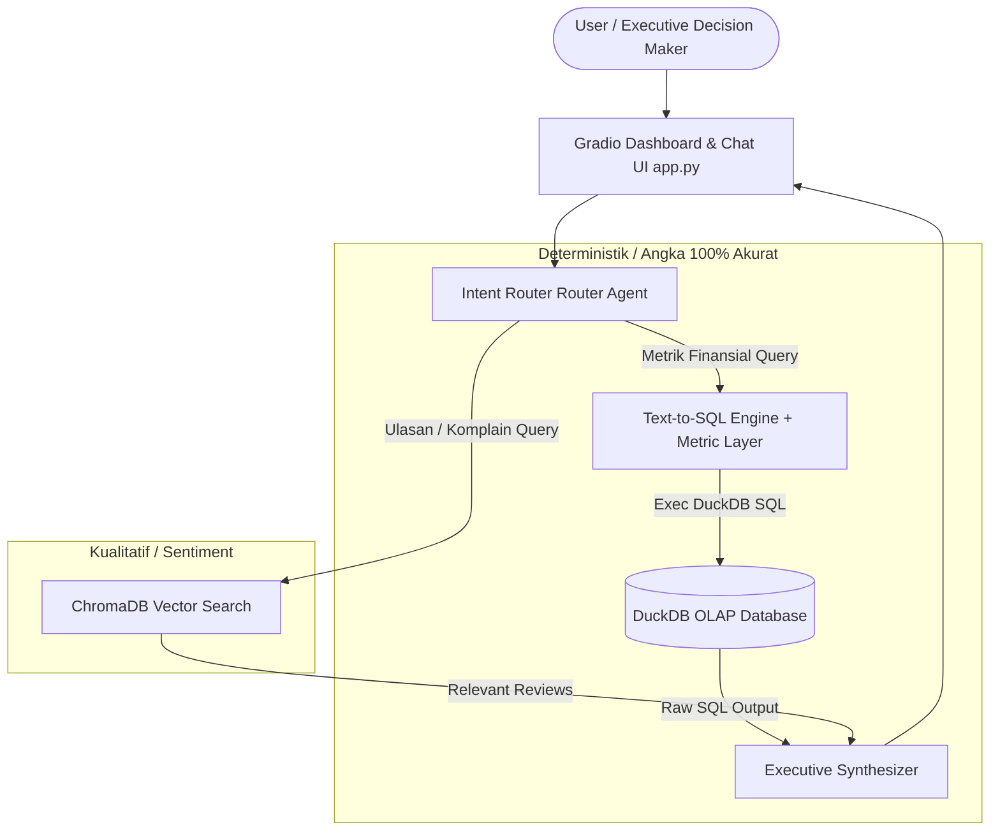

# 🛒 Marketplace Intelligence System (Hybrid RAG)

> **Enterprise-grade Executive Assistant & Anti-Hallucination RAG for Messy Multi-Channel E-Commerce Data.**

---

## 🎯 Executive Summary & Business Problem

Di industri e-commerce, eksekutif bisnis sering dihadapkan pada dua masalah besar saat menggunakan AI:
1. **Data Kotor & Tersebar:** Data transaksi Tokopedia, Shopee, TikTok Shop, dan Lazada memiliki format kolom, status retur, dan penamaan SKU yang tidak seragam.
2. **Halusinasi Angka LLM:** RAG berbasis vector embedding biasa **pasti gagal dan berhalusinasi** saat menghitung agregasi finansial (Net GMV, Margin, Retur Rate).

**Marketplace RAG Intelligence** memecahkan masalah ini dengan menggabungkan **DuckDB OLAP Engine (Text-to-SQL dengan Semantic Metric Layer)** untuk perhitungan angka 100% deterministik dan **ChromaDB Vector Store** untuk analisis kualitatif ulasan pelanggan.

---

## 🏗️ System Architecture & Data Flow



---

## 🌟 Key Features

1. **Anti-Hallucination Metric Layer:** Penjualan kotor (`order_value`), voucher seller, dan pesanan retur (`CANCELLED` / `RETURNED`) dipisahkan secara ketat sesuai standar akuntansi e-commerce di [`docs/metrics_dictionary.md`](docs/metrics_dictionary.md).
2. **Text-to-SQL dengan Self-Correction:** Jika LLM menghasilkan sintaks SQL yang salah, sistem secara otomatis menangkap error DuckDB dan melakukan *auto-correction retry loop*.
3. **Hybrid Root-Cause Analysis:** Mampu menjawab pertanyaan kompleks seperti *"Berapa kerugian retur produk X di Shopee dan apa penyebab utama komplainnya?"*.
4. **Interactive Executive Dashboard:** Visualisasi KPI Net GMV, Completed Orders, dan Return Rate secara real-time via Gradio UI.

---

## 🛠️ Tech Stack & Code Patterns

| Layer | Technology | Alasan Pemilihan |
| :--- | :--- | :--- |
| **Data Processing** | DuckDB Native Engine | Processing OLAP in-process super cepat untuk jutaan baris data |
| **Vector Store** | ChromaDB | Local vector search untuk semantic retrieval ulasan pelanggan |
| **LLM & RAG** | Google Gemini API (2.5 Flash) | Inferensi cepat & akurat untuk Text-to-SQL dan Synthesis |
| **UI** | Gradio 4.x | Antarmuka interaktif modern dengan audit trail SQL inspector |
| **Architecture** | Clean & Modular Pattern | Decoupled pipeline, database access, dan agent engine |

---

## 🚀 Quickstart Guide

### 1. Prasyarat & Clone Repo
```powershell
git clone <url-repository-anda>
cd rag-marketplace
```

### 2. Setup Virtual Environment & Activate
```powershell
py -m venv .venv
.\.venv\Scripts\activate
pip install -r requirements.txt
```

### 3. Konfigurasi Environment Variable
Salin `.env.example` menjadi `.env` dan masukkan API Key Gemini Anda:
```env
GEMINI_API_KEY=your_gemini_api_key_here
```

### 4. Jalankan Pipeline & Aplikasi
```powershell
# Pastikan virtualenv sudah aktif ( (venv) muncul di terminal )
.\.venv\Scripts\activate

# 1. Pipeline Data Ingestion ke DuckDB
python src/data_pipeline.py

# 2. Jalankan Automated Test Evaluation Suite
python evaluate.py

# 3. Jalankan Aplikasi Web Gradio
python app.py
```

Buka browser di `http://127.0.0.1:7860`.

---

## 📂 Project Structure

```text
rag-marketplace/
├── SYSTEM_STATE.md            # Living context status proyek (Auto-synced via /sync-docs)
├── data/                      # Data storage (raw_marketplace.csv & marketplace.duckdb)
├── docs/                      # Dokumentasi Arsitektur & Kamus Metrik Bisnis
├── src/                       # Backend Logic (data_pipeline.py, database.py, rag_engine.py)
├── app.py                     # Gradio Dashboard & Chatbot UI
├── evaluate.py                # Automated RAG Evaluation Suite
├── requirements.txt           # Dependencies Python
└── README.md                  # Halaman Utama Portofolio
```
