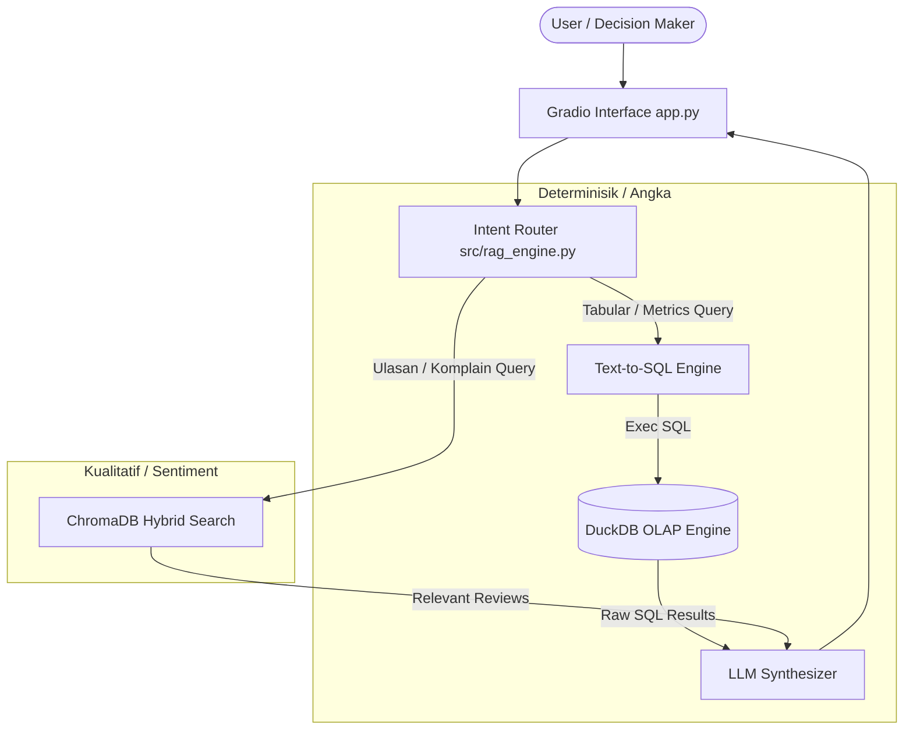

# 🏗️ System Architecture & Data Flow

## System Overview Diagram

## Architectural Rationale
1. **Mengapa DuckDB?** DuckDB adalah OLAP in-process database yang memproses jutaan baris data agregasi (SUM, AVG, GROUP BY) dalam hitungan milidetik secara lokal tanpa overhead server DB.
2. **Mengapa Text-to-SQL + Metrics Layer?** RAG berbasis vector embedding biasa **pasti halusinasi** saat ditanya total nilai penjualan. Text-to-SQL memastikan perhitungan matematika 100% tepat.
3. **Mengapa ChromaDB?** Ringan, file-based, gratis, dan mendukung vector similarity search untuk ulasan pelanggan secara lokal.
